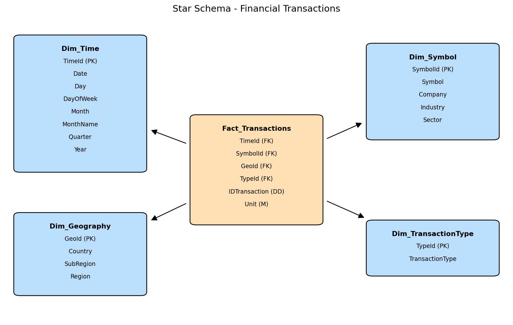

# Homework 3 — Part 1: Star Schema Modeling

**Course:** Big Data Analytics — MSc in Data Science
**Topic:** Data Warehouse design for financial transactions

This folder contains **Part 1** of Homework 3: the dimensional (star schema) modeling
of a financial-transactions data warehouse. The ETL implementation and the analytical
questions (Part 2) and the Streamlit dashboard (Part 3) are **not** included here.

## What Part 1 does

Starting from three source files (`symbols.csv`, the account statement and
`country.csv`), Part 1 designs a **ROLAP star schema** on paper and draws its diagram:

- **1.1 — Business Process & Fact Grain.** The fact is one *event/transaction*:
  one row of `Fact_Transactions` represents **one transaction** from the account
  statement (finest grain, no pre-aggregation).
- **1.2 — Fact and Dimensions.** Each source attribute is assigned either to the fact
  table or to exactly **one** dimension, avoiding duplication (e.g. `country` lives
  only in `Dim_Geography`).
- **1.3 — Dimension Hierarchies.** Day → Month → Quarter → Year (Time);
  Country → Sub-region → Region (Geography); Symbol → Industry → Sector (Symbol).
- **1.4 — Star Schema.** The final schema with **surrogate keys** (PK) on every
  dimension and the matching **foreign keys** in the fact table. The notebook cell
  draws the diagram and saves it as `star_schema.png`.

## Star schema

```
Fact_Transactions ( TimeId(FK), SymbolId(FK), GeoId(FK), TypeId(FK), IDTransaction, Unit )
Dim_Time          ( TimeId(PK), Date, Day, DayOfWeek, Month, MonthName, Quarter, Year )
Dim_Symbol        ( SymbolId(PK), Symbol, Company, Industry, Sector )
Dim_Geography     ( GeoId(PK), Country, SubRegion, Region )
Dim_TransactionType ( TypeId(PK), TransactionType )
```



- `Unit` is the only explicit **measure** (additive via SUM).
- `IDTransaction` is kept as a **descriptive (degenerate)** attribute for traceability.

## Files in this folder

| File | Description |
|------|-------------|
| `Homework3.ipynb` | Part 1 notebook: modeling (1.1–1.4) + the code cell that draws the star schema |
| `star_schema.png` | Star schema diagram (Part 1 deliverable) generated by the notebook |
| `Homework3_Financial_Transactions.pdf` | Original assignment text |
| `symbols.csv`, `country.csv`, `account-statement-1-1-2024-12-31-2024.csv` | Source datasets (used by Part 2; included here for reference) |

## How to reproduce the diagram

The Part 1 code cell only needs `matplotlib` and reads **no** data file:

```bash
pip install matplotlib
jupyter notebook Homework3.ipynb
```

Running the code cell regenerates `star_schema.png`.
